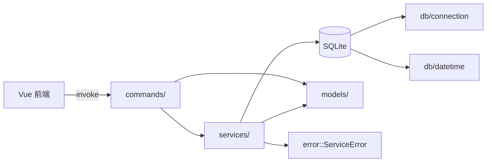

# workOrder 后端架构

**日期：** 2026-07-07  
**状态：** 已实施  
**相关文档：** [Tauri Command API](api/commands.md)、[迁移设计](../superpowers/specs/2026-07-06-tauri-migration-design.md)

---

## 1. 概述

workOrder 后端是 **Tauri 2 + Rust + SQLite** 本地服务，无 HTTP 层。前端 Vue 通过 Tauri `invoke` 调用 Rust Command，数据持久化在 `workorder.db`。

类型绑定由 [tauri-specta](https://docs.rs/tauri-specta) 从 Rust 自动生成至 [`src/bindings.ts`](../../src/bindings.ts)。

---

## 2. 分层架构



| 层级 | 目录 | 职责 |
|------|------|------|
| Command | `src-tauri/src/commands/` | Tauri 入口，获取 `AppState` 数据库锁，调用 Service |
| Service | `src-tauri/src/services/` | 业务逻辑、SQL、校验 |
| Model | `src-tauri/src/models/` | 数据结构，Serde + Specta 序列化 |
| DB | `src-tauri/src/db/` | 连接、schema、日期时间工具 |
| Error | `src-tauri/src/error.rs` | 统一错误类型 |

---

## 3. 数据流

1. 前端调用 `commands.listWorkOrders(...)`（来自 `bindings.ts`）
2. Tauri IPC 路由至 `commands::work_order::list_work_orders`
3. Command 锁定 `AppState.db`，调用 `work_order_service::find_by_statuses`
4. Service 执行 SQL，映射为 `WorkOrder` 结构体
5. Serde 序列化为 camelCase JSON 返回前端

---

## 4. 应用状态

```rust
pub struct AppState {
    pub db: Mutex<Connection>,
}
```

在 `lib.rs` 的 `setup` 中初始化：解析数据目录 → 打开 SQLite → `app.manage(AppState { ... })`。

---

## 5. 错误处理

`ServiceError` 四种变体：

| 变体 | code | 场景 |
|------|------|------|
| `NotFound` | `NOT_FOUND` | 工单/日志不存在 |
| `Validation` | `VALIDATION` | 空标题、空进度、归属不匹配 |
| `Database` | `DATABASE` | SQLite 错误 |
| `Io` | `IO` | 文件系统错误 |

Command 层将 `ServiceError` 转为 JSON 字符串，前端 `invoke` 失败时抛出。

---

## 6. 数据库

### 6.1 表结构

见 [`src-tauri/src/db/schema.sql`](../../src-tauri/src/db/schema.sql)：

- `work_order`：工单主表（status、priority、waiting 字段、due_date）
- `progress_log`：进度日志（外键 `work_order_id`，级联删除）

### 6.2 数据目录

优先级（见 `db/connection::resolve_data_dir`）：

1. 环境变量 `WORKORDER_DATA_DIR`
2. Tauri 配置目录（若传入）
3. 向上查找含 `data/workorder.db` 或 `data/` 的目录
4. 可执行文件旁 `data/`

---

## 7. 业务规则

- **priority**：新建工单取当前最大值 +1；拖拽排序通过 `update_priorities` 按数组下标重写
- **待回复日志**：创建或更新工单进入/变更 `WAITING_REPLY` 状态时，自动插入格式化进度日志
- **逾期判定**：有 `due_date`、状态非 `COMPLETED`、且早于当前 UTC 时间
- **日期兼容**：`datetime` 模块支持 ISO 字符串与 Java 遗留 epoch 毫秒整数

---

## 8. 类型绑定（tauri-specta）

### 8.1 生成方式

详见 [开发者常用命令](dev-commands.md#类型绑定tauri-specta)。

```bash
npm run bindings          # 推荐
npm run tauri dev         # debug 启动时自动导出
```

产物：[`src/bindings.ts`](../../src/bindings.ts)（**勿手动编辑**）。

### 8.2 前端使用

```typescript
import { commands } from "./bindings";
import type { WorkOrder } from "./bindings";

const list = await commands.listWorkOrders([], false);
```

`src/api/*.ts` 为薄封装，便于保持现有 import 路径；类型定义以 `bindings.ts` 为准。

---

## 9. 开发命令

完整列表见 **[开发者常用命令](dev-commands.md)**。

```bash
npm run tauri dev                              # 开发运行
npm run bindings                               # 重新生成 TypeScript 绑定
cd src-tauri && cargo doc --no-deps --open     # Rust API 文档
cd src-tauri && cargo test                     # Rust 单元测试
```

---

## 10. 目录索引

```
src-tauri/src/
├── lib.rs              # 入口、AppState、Specta 导出
├── error.rs            # ServiceError
├── commands/           # Tauri Command（11 个）
├── services/           # 业务逻辑
├── models/             # 数据模型
└── db/
    ├── connection.rs   # 数据目录与连接
    ├── datetime.rs     # 日期时间工具
    └── schema.sql      # DDL
```
