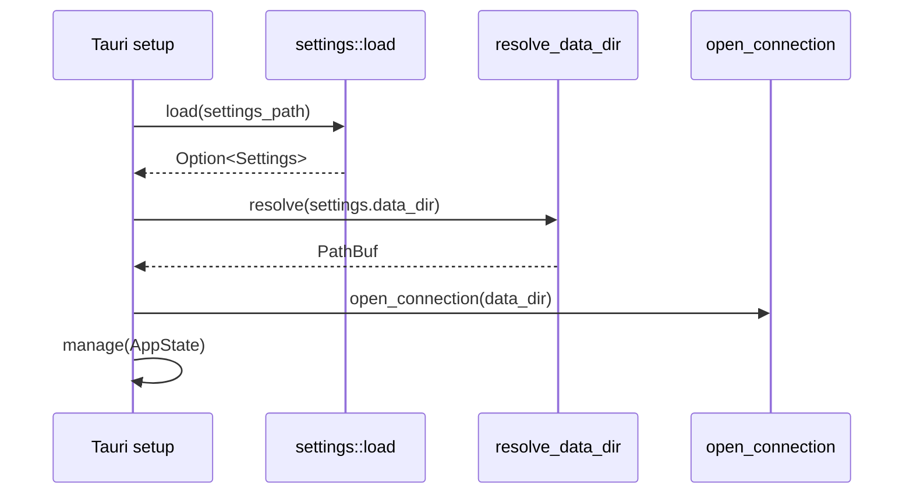
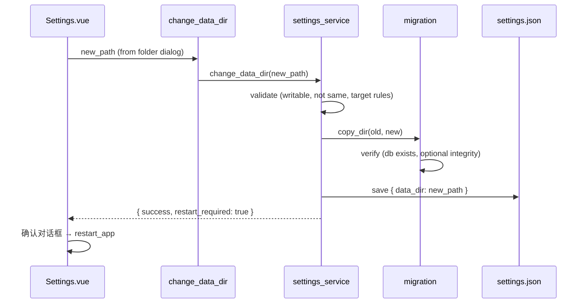

# workOrder 设置 — 数据目录与迁移设计

**日期：** 2026-07-07  
**状态：** 已批准（方案 A）  
**相关文档：** [backend.md](../../backend.md)、[Tauri 迁移设计](2026-07-06-tauri-migration-design.md)

---

## 1. 背景与目标

### 1.1 需求

用户希望在应用内提供**设置**功能，首期支持：

1. **设定数据目录**：整个数据目录（含 `workorder.db` 及将来同目录下的其他文件）的存储位置可配置。
2. **目录变更时自动迁移**：用户修改目录后，将原目录数据**复制**到新位置；成功后**保留**旧数据。
3. **迁移后重启**：迁移完成并写入配置后，提示用户重启应用以使新路径生效。

### 1.2 已确认决策

| 决策项 | 选择 |
|--------|------|
| 存储范围 | 整个数据目录（A） |
| 配置文件位置 | 可执行文件旁 `settings.json`（B，便携版友好） |
| 迁移策略 | 复制到新位置，成功后保留旧数据（A） |
| 重启行为 | 迁移完成后提示重启（A） |

### 1.3 非目标（本期）

- 工单附件、独立资源子目录的单独配置（未来可扩展同一 `data_dir`）
- 热切换数据库连接（无需重启）
- 多用户 / 云同步
- vue-router 引入（沿用现有组件状态切换模式）

---

## 2. 方案对比

### 方案 A：exe 旁 `settings.json` + 扩展 `resolve_data_dir`（推荐）

在可执行文件目录读写 `settings.json`，启动时由 `resolve_data_dir` 读取其中的 `data_dir`；设置页通过 Tauri Command 浏览文件夹、触发迁移并写配置。

| 优点 | 缺点 |
|------|------|
| 与便携版 `portable/` 布局一致，拷贝整个文件夹即可带走配置与默认数据 | 开发模式下 exe 在 `target/debug/`，`settings.json` 会落在该目录（可通过「无配置文件时走现有启发式」缓解） |
| 配置与数据分离，避免「鸡生蛋」 | 安装版若 exe 在 Program Files，旁写配置可能需 UAC（见 §7.2） |
| 改动集中在 `db/connection` + 新 `settings` 模块，符合现有分层 | 需新增 `tauri-plugin-dialog` 依赖 |

### 方案 B：仅使用 `tauri.conf.json` 的 `plugins.workorder.data.dir`

构建时或手动编辑 JSON 指定目录，Rust 启动时读取插件配置。

| 优点 | 缺点 |
|------|------|
| 无额外配置文件 | 用户无法在应用内修改；改路径需改配置文件并重启 |
| | 与「设置 UI + 迁移」需求不匹配 |
| | 安装后配置文件只读，不适合最终用户 |

### 方案 C：系统 AppData 存配置 + exe 旁仅数据

`%APPDATA%/workOrder/settings.json` 存路径，数据可在任意位置。

| 优点 | 缺点 |
|------|------|
| 安装版写入无权限问题 | 用户已选择 exe 旁配置（B），与决策冲突 |
| 便携版与安装版行为不一致 | 便携拷贝时需额外拷贝 AppData |

**推荐方案 A**：满足用户全部决策，复用现有 `resolve_data_dir` 入口，实现成本可控。

---

## 3. 架构

### 3.1 模块划分

```
src-tauri/src/
├── settings/
│   ├── mod.rs           # 配置路径解析、load/save
│   └── migration.rs     # 目录复制与校验
├── db/
│   └── connection.rs    # resolve_data_dir 增加 settings 参数
├── commands/
│   └── settings.rs      # get_settings, change_data_dir, restart_app
├── services/
│   └── settings_service.rs  # 编排校验 + 迁移 + 写配置
└── lib.rs               # setup 中 load settings → resolve_data_dir
```

```
src/
├── views/
│   └── Settings.vue     # 设置弹窗
├── api/
│   └── settings.ts      # 调用 bindings
└── App.vue              # 增加设置入口与 settingsVisible 状态
```

### 3.2 数据目录解析优先级（更新后）

`resolve_data_dir(settings_dir: Option<&str>, config_dir: Option<&str>)` 优先级：

1. 环境变量 `WORKORDER_DATA_DIR`（开发/调试覆盖，最高）
2. `settings.json` 中的 `data_dir`（非空绝对路径；若路径不存在则尝试创建；若不可创建则**启动失败**并提示检查设置，不静默回退）
3. 参数 `config_dir`（保留，兼容 `tauri.conf.json` 占位，当前可为空）
4. 自当前/可执行文件目录向上查找含 `data/workorder.db` 或 `data/` 的目录
5. 可执行文件旁 `data/`（默认）

`settings.json` 路径：`{executable_parent}/settings.json`，与数据目录无关。

### 3.3 配置文件格式

```json
{
  "version": 1,
  "data_dir": "D:\\workorder-data"
}
```

| 字段 | 说明 |
|------|------|
| `version` | 配置 schema 版本，便于将来迁移 |
| `data_dir` | 绝对路径，UTF-8，Windows 反斜杠在 JSON 中转义 |

首次运行无 `settings.json` 时：按优先级 4–5 解析数据目录，**不自动创建** settings 文件（避免覆盖用户未配置的便携默认行为）。用户首次在设置页「应用」时写入。

### 3.4 应用状态扩展

```rust
pub struct AppState {
    pub db: Mutex<Connection>,
    pub data_dir: PathBuf,           // 当前会话使用的数据目录
    pub settings_path: PathBuf,      // settings.json 绝对路径
}
```

`data_dir` 供设置页展示；迁移成功后仍使用旧连接直至重启。

---

## 4. 数据流

### 4.1 启动



### 4.2 修改数据目录



### 4.3 Tauri Commands（新增）

| Command | 参数 | 返回 | 说明 |
|---------|------|------|------|
| `get_settings` | — | `SettingsInfo` | 当前数据目录、settings 文件路径、是否由 env 覆盖 |
| `pick_data_dir` | — | `Option<String>` | 打开文件夹选择对话框 |
| `change_data_dir` | `new_path: String` | `ChangeDataDirResult` | 校验、迁移、写配置 |
| `restart_app` | — | `()` | 调用 `app.restart()` |

类型经 tauri-specta 导出至 `src/bindings.ts`。

**`SettingsInfo` 示例：**

```typescript
{
  dataDir: string;
  settingsPath: string;
  envOverride: boolean;  // WORKORDER_DATA_DIR 是否生效
  defaultDataDir: string; // 无 settings 时的解析结果（展示用）
}
```

**`ChangeDataDirResult`：**

```typescript
{
  success: boolean;
  restartRequired: boolean;
  newDataDir: string;
}
```

---

## 5. 迁移逻辑

### 5.1 复制范围

复制**当前数据目录下的全部文件与子目录**到新目录，至少包括 `workorder.db`。使用递归复制，保留文件元数据（可选，非必须）。

### 5.2 目标目录规则

| 条件 | 处理 |
|------|------|
| 新路径与当前 `data_dir` 相同（规范化后） | 拒绝，`VALIDATION` |
| 新路径不可写或无法创建 | 拒绝，`IO` |
| 新路径是当前目录的子目录或父目录导致冲突 | 拒绝，`VALIDATION` |
| 新路径为空目录 | 允许，直接复制 |
| 新路径已含 `workorder.db` | 拒绝，`VALIDATION`（避免误覆盖；用户需先清空或选其他路径） |
| 新路径含其他文件但无 `workorder.db` | 拒绝，`VALIDATION`（要求空目录） |

### 5.3 失败与回滚

1. 复制前不修改 `settings.json`。
2. 复制失败：返回错误，新目录中已复制文件可保留（用户手动清理）；**不**更新配置。
3. 复制成功但写 `settings.json` 失败：返回错误；旧数据仍在原处；新目录已有副本（与「保留旧数据」一致）。
4. 不对旧目录做删除或重命名。

### 5.4 校验（复制后）

- 目标目录存在 `workorder.db`
- 文件大小与原库一致（快速校验）
- 可选：`PRAGMA integrity_check` 对新库执行（推荐，成本低）

---

## 6. 错误处理

沿用 `ServiceError`，新增设置相关校验消息（`Validation` / `Io`）：

| 场景 | code | 用户可见消息（中文） |
|------|------|----------------------|
| 路径相同 | VALIDATION | 新目录与当前目录相同 |
| 目标非空 | VALIDATION | 目标目录必须为空 |
| 无写入权限 | IO | 无法写入目标目录 |
| 复制失败 | IO | 数据迁移失败：{详情} |
| 校验失败 | VALIDATION | 迁移后的数据库校验失败 |
| env 覆盖生效时尝试修改 | VALIDATION | 当前由环境变量 WORKORDER_DATA_DIR 指定，无法在应用内修改 |

`get_settings` 在 `envOverride === true` 时，设置页禁用「更改目录」并显示说明。

Command 层继续将 `ServiceError` 序列化为 JSON 字符串，前端 `message.error` 展示 `message` 字段。

---

## 7. 前端 UI

### 7.1 入口

在 `WorkOrderList.vue` 工具栏右侧增加「设置」按钮（`n-button` tertiary），点击后 `App.vue` 打开设置弹窗（与工单详情相同模式：`settingsVisible` + `Settings.vue`）。

### 7.2 设置弹窗布局

```
┌─────────────────────────────────────────────┐
│  设置                                    ✕  │
├─────────────────────────────────────────────┤
│  数据存储位置                                │
│  ┌─────────────────────────────────────┐   │
│  │ D:\portable\data          (只读展示)  │   │
│  └─────────────────────────────────────┘   │
│  [ 浏览... ]                                │
│                                             │
│  ⓘ 更改后将复制数据到新位置，并需要重启应用。  │
│     原数据会保留。                           │
│                                             │
│              [ 取消 ]  [ 应用并重启 ]        │
└─────────────────────────────────────────────┘
```

- **浏览**：调用 `pick_data_dir`，将选中路径填入待应用状态（未写入磁盘）。
- **应用并重启**：仅当所选路径与当前 `dataDir` 不同时启用；调用 `change_data_dir`；成功则 `n-dialog` 确认「迁移完成，是否立即重启？」→ `restart_app`。
- 加载时调用 `get_settings` 填充当前路径；若 `envOverride`，禁用浏览与应用并显示提示。

### 7.3 依赖

- 新增 `tauri-plugin-dialog`（文件夹选择）
- 在 `lib.rs` 注册 plugin；`capabilities` 中授予 dialog 权限

---

## 8. 开发与便携场景

| 场景 | 行为 |
|------|------|
| `npm run tauri dev` | 无 `settings.json` 时仍用向上查找 → 项目根 `data/`；env 可覆盖 |
| `portable/workOrder.exe` | 默认可执行文件旁 `data/`；用户在设置中修改后生成 `portable/settings.json` |
| 拷贝 portable 文件夹 | `settings.json` + `data/` 一并带走；若 `settings.json` 指向绝对路径，换机器后需重新设置或继续使用相对默认 |
| `WORKORDER_DATA_DIR` | 开发调试优先；设置 UI 只读提示 |

**说明：** 安装到 `Program Files` 时，exe 旁写入 `settings.json` 可能因权限失败。本期以便携版为主；若需支持安装版，后续可增加「配置写 AppData、数据目录用户自选」的回退（不在本期范围）。

---

## 9. 测试计划

### 9.1 Rust 单元测试

- `settings::load` / `save` 读写临时目录
- `migration::copy_data_dir`：空目标、含 db、目标非空拒绝
- `resolve_data_dir`：settings 优先于向上查找；env 优先于 settings

### 9.2 手动测试

1. 首次启动 → 设置页显示当前 `data` 路径
2. 选择空文件夹 → 迁移成功 → 重启 → 工单数据完整
3. 原 `data/` 目录仍存在且可打开 db
4. 选择非空目录 → 错误提示
5. 设置 `WORKORDER_DATA_DIR` → 设置页禁用更改

---

## 10. 实施清单（供实现计划引用）

1. 新增 `settings` 模块与 `settings_service`
2. 更新 `resolve_data_dir` 签名与 `lib.rs` setup
3. 扩展 `AppState`
4. 新增 `commands/settings.rs` 并注册 specta
5. 添加 `tauri-plugin-dialog`，配置 capabilities
6. 前端 `Settings.vue`、`api/settings.ts`、`App.vue` / 工具栏入口
7. 运行 `npm run bindings` 更新 `bindings.ts`
8. 补充 `docs/api/commands.md` 设置相关 API 说明

---

## 11. 将来扩展

- `settings.json` 增加主题、语言等字段（同一文件）
- 安装版配置回退至 AppData
- 迁移进度条（大文件/多文件时）
- 附件目录与 `data_dir` 下 `attachments/` 子目录约定
