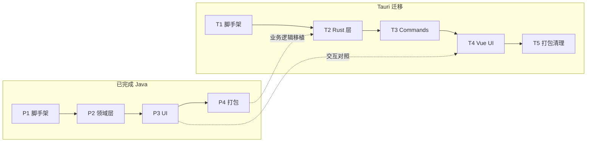
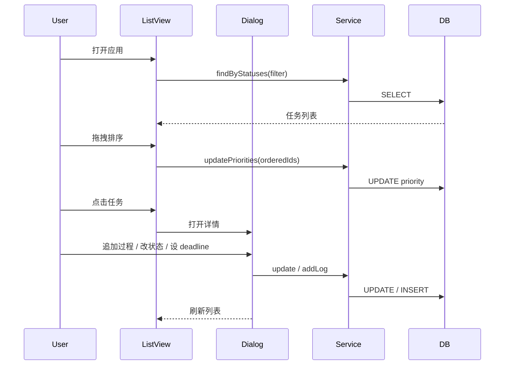

# workOrder 个人代办清单 — 实现计划

> **架构状态（2026-07-06）**：§2–§10 为原 **Java + Vaadin** 实现计划（P1–P4 已完成开发）；因启动资源占用过高，现执行 **§11 Tauri 迁移计划**（原地替换）。技术细节见 [技术选型.md](./技术选型.md) §3、[Tauri 迁移设计](../docs/superpowers/specs/2026-07-06-tauri-migration-design.md)。

## 1. 概述

本文档描述 workOrder MVP 的分阶段实现计划。

| 阶段 | 技术栈 | 状态 |
|------|--------|------|
| P1–P4 | Vaadin Flow + Spring Boot 3 + SQLite + JavaFX | **已完成**（待替换） |
| T1–T5 | Tauri 2 + Vue 3 + Rust + rusqlite | **进行中** |

**预计阶段**：原 4 阶段 + Tauri 迁移 5 阶段。

---

## 2. 阶段总览

### 2.1 原 Java 方案（P1–P4，已完成）

| 阶段 | 名称 | 目标 | 产出 | 状态 |
|------|------|------|------|------|
| P1 | 项目脚手架 | 可运行的空壳应用 | Maven 工程 + SQLite 连通 | 已完成 |
| P2 | 领域层与数据层 | 核心业务逻辑就绪 | Entity / Repository / Service | 已完成 |
| P3 | Vaadin UI | 完整 MVP 交互 | 列表、编辑、筛选、拖拽、时间线 | 已完成 |
| P4 | 桌面打包 | 可分发桌面应用 | Windows exe + JavaFX WebView | 已完成 |

### 2.2 Tauri 迁移（T1–T5，现行）

| 阶段 | 名称 | 目标 | 产出 |
|------|------|------|------|
| T1 | Tauri 脚手架 | 可运行的空壳桌面应用 | Tauri 2 + Vue 3 工程 |
| T2 | Rust 数据层与服务 | 业务逻辑就绪 | models / db / services + 单元测试 |
| T3 | Tauri Commands | 前后端连通 | invoke API 全部就绪 |
| T4 | Vue UI | MVP 功能对齐 | 列表、详情、筛选、拖拽、时间线 |
| T5 | 打包与清理 | 可分发 + 删除 Java 代码 | exe/MSI + 移除 pom.xml 等 |



---

## 3. 原阶段一：项目脚手架（P1，已完成）

### 3.1 目标

创建 Maven 工程，集成 Spring Boot + Vaadin + SQLite，应用可启动并显示空白页面。

### 3.2 任务清单

| 序号 | 任务 | 细节 |
|------|------|------|
| P1-1 | 初始化 Maven 项目 | `groupId`: `com.workorder`，`artifactId`: `workorder` |
| P1-2 | 添加依赖 | `spring-boot-starter`、`vaadin-spring-boot-starter`、`spring-boot-starter-data-jpa`、`sqlite-jdbc`、sqlite Hibernate 方言、**flyway-core** |
| P1-3 | 配置 SQLite | `application.properties` 指向 `%USERPROFILE%/.workOrder/data/workorder.db` |
| P1-3b | 配置 Flyway | `spring.flyway.enabled=true`；**禁用** `ddl-auto=update`（开发可用 validate）；首版脚本 `V1__init_schema.sql` |
| P1-4 | 创建 Application 入口 | `WorkOrderApplication.java`，`@SpringBootApplication` |
| P1-5 | 创建空白 MainLayout | Vaadin `AppLayout` + 占位首页 |
| P1-6 | 验证启动 | `mvn spring-boot:run`，浏览器访问 localhost 可见页面 |

### 3.3 验收

- [ ] `mvn spring-boot:run` 无报错启动
- [ ] SQLite 数据库文件自动创建
- [ ] Vaadin 页面正常渲染

---

## 4. 原阶段二：领域层与数据层（P2，已完成）

### 4.1 目标

实现数据模型、持久化、业务 Service，可通过单元测试或临时接口验证 CRUD。

### 4.2 数据模型

#### WorkOrder 实体

```java
@Entity
@Table(name = "work_order")
public class WorkOrder {
    @Id @GeneratedValue
    private Long id;
    private String title;              // 必填
    private String description;        // 可选
    @Enumerated(EnumType.STRING)
    private WorkOrderStatus status;    // 默认 NOT_STARTED
    private Integer priority;            // 排序序号，越小越靠前
    private String waitingFor;         // 等待对象，可选
    private String waitingReason;      // 等待原因，可选
    private LocalDateTime dueDate;     // 计划完成时间，可选
    private LocalDateTime createdAt;
    private LocalDateTime updatedAt;
}
```

#### WorkOrderStatus 枚举

```java
public enum WorkOrderStatus {
    NOT_STARTED,    // 未处置
    IN_PROGRESS,    // 处置中（进行中）
    WAITING_REPLY,  // 待回复
    COMPLETED       // 已完成
}
```

#### ProgressLog 实体

```java
@Entity
@Table(name = "progress_log")
public class ProgressLog {
    @Id @GeneratedValue
    private Long id;
    private Long workOrderId;
    private String content;
    private LocalDateTime createdAt;
}
```

### 4.3 任务清单

| 序号 | 任务 | 细节 |
|------|------|------|
| P2-1 | 创建枚举 WorkOrderStatus | 含中文 displayName 方法供 UI 使用 |
| P2-2 | 创建 WorkOrder 实体 | JPA 注解 + `@PrePersist` / `@PreUpdate` 自动维护时间 |
| P2-3 | 创建 ProgressLog 实体 | 外键关联 workOrderId |
| P2-4 | 创建 Repository 接口 | `WorkOrderRepository`、`ProgressLogRepository` |
| P2-5 | 实现 WorkOrderService | CRUD、按 priority 排序查询、按 status 筛选、批量更新 priority |
| P2-6 | 实现 ProgressLogService | 追加、更新、删除记录；按 workOrderId 查询（倒序） |
| P2-7 | 编写 Service 单元测试 | 覆盖创建、更新状态、排序、筛选、追加/编辑/删除过程、待回复自动记过程 |

### 4.4 Service 核心方法

```java
// WorkOrderService
WorkOrder create(WorkOrder workOrder);
WorkOrder update(Long id, WorkOrder workOrder);
void delete(Long id);
List<WorkOrder> findAll(Sort sort);
List<WorkOrder> findByStatuses(List<WorkOrderStatus> statuses, boolean includeCompleted);
void updatePriorities(List<Long> orderedIds);  // 拖拽后批量更新 priority
boolean isOverdue(WorkOrder workOrder);          // dueDate 过期且未完成
// 保存为待回复或等待信息变更时，自动写入 progress_log

// ProgressLogService
ProgressLog addLog(Long workOrderId, String content);
ProgressLog updateLog(Long logId, Long workOrderId, String content);
void deleteLog(Long logId, Long workOrderId);
List<ProgressLog> findByWorkOrderId(Long workOrderId);
```

### 4.5 验收

- [ ] 单元测试全部通过
- [ ] 可通过 Service 完成 CRUD、筛选、排序、过程记录

---

## 5. 原阶段三：Vaadin UI（P3，已完成）

### 5.1 目标

实现 MVP 全部用户交互：列表、新建、编辑、删除、拖拽排序、状态筛选、过程时间线、过期高亮。

### 5.2 页面结构

```
MainLayout (AppLayout)
└── WorkOrderListView (默认路由 @Route "")
    ├── 顶部工具栏
    │   ├── [新建] 按钮
    │   ├── 状态筛选 Checkbox 组（未处置 / 处置中 / 待回复 / 已完成）
    │   └── [显示已完成] Checkbox
    ├── Grid<WorkOrder> 列表
    │   ├── 列：标题、状态、计划完成时间、最后更新
    │   ├── 行拖拽排序
    │   └── 过期行高亮（CSS class: overdue-row）
    └── WorkOrderDetailDialog（点击行打开）
        ├── 标题 TextField
        ├── 描述 TextArea
        ├── 状态 RadioButtonGroup
        ├── 计划完成时间 DateTimePicker
        ├── 等待对象/原因（条件显示）
        ├── 处置过程时间线（每条含 [编辑] [删除]）
        ├── [追加过程] 输入 + [追加]/[保存修改] + [取消] 按钮
        └── [保存] [删除] 按钮
```

### 5.3 任务清单

| 序号 | 任务 | 细节 |
|------|------|------|
| P3-1 | MainLayout | AppLayout + 应用标题「workOrder」 |
| P3-2 | WorkOrderListView 骨架 | Grid 绑定 Service 数据 |
| P3-3 | 新建功能 | Toolbar 按钮 → 打开空 Dialog → 保存 |
| P3-4 | 编辑/详情 Dialog | 点击 Grid 行打开，表单绑定实体 |
| P3-5 | 状态切换 | RadioButtonGroup（桌面 WebView 避免浮层失效） |
| P3-6 | 待回复条件字段 | 状态=WAITING_REPLY 时显示 waitingFor / waitingReason；保存时自动写入过程时间线 |
| P3-7 | 处置过程时间线 | Dialog 内 VerticalLayout 展示 ProgressLog 列表，每行含编辑/删除 |
| P3-8 | 追加/编辑过程 | 底部 TextField + Button；编辑时加载内容，支持保存修改与取消 |
| P3-8b | 删除过程 | 单条确认删除 → ProgressLogService.deleteLog |
| P3-9 | 状态筛选 | 各状态 Checkbox 组合 → 刷新 Grid 数据 |
| P3-10 | 隐藏已完成 | Checkbox 切换 → 过滤 COMPLETED 状态 |
| P3-11 | 拖拽排序 | Grid setRowsDraggable + dropListener → updatePriorities |
| P3-12 | 过期高亮 | setClassNameGenerator：dueDate < now && status != COMPLETED → "overdue-row" |
| P3-13 | 删除功能 | Dialog 内删除按钮 + 确认 |
| P3-14 | 主题样式 | `overdue-row` CSS：红色文字或背景色 |

### 5.4 交互流程



### 5.5 验收

- [ ] 全部功能需求（F-001 ~ F-022）可操作
- [ ] 拖拽排序重启后保持
- [ ] 过期任务有明显视觉区分
- [ ] 筛选、隐藏已完成正常工作

---

## 6. 原阶段四：桌面打包（P4，已完成）

### 6.1 目标

将应用打包为 Windows 可执行程序，双击启动后自动打开工作窗口。

### 6.2 任务清单

| 序号 | 任务 | 细节 |
|------|------|------|
| P4-1 | 创建 DesktopLauncher | 独立 Main 类：启动 Spring Boot → 等待端口就绪 → JavaFX WebView 打开窗口 |
| P4-2 | 端口检测 | 读取 `server.port`（默认 8081），轮询直到服务可用 |
| P4-3 | 桌面窗口 | 优先 `WebViewShell`（JavaFX WebView）；失败时 fallback 到 Chrome/Edge app 模式或默认浏览器 |
| P4-4 | 配置 jpackage | Maven plugin 或脚本：`jpackage --input target --main-jar workorder.jar --main-class DesktopLauncher` |
| P4-5 | 应用图标 | 准备 `.ico` 文件供 jpackage 使用 |
| P4-6 | 数据目录初始化 | 首次启动自动创建 `%USERPROFILE%/.workOrder/data/` |
| P4-7 | 打包验证 | 在干净 Windows 环境双击 exe 测试完整流程 |

### 6.3 DesktopLauncher 伪代码

```java
public class DesktopLauncher {
    public static void main(String[] args) {
        // 1. 后台线程启动 Spring Boot
        ConfigurableApplicationContext ctx =
            SpringApplication.run(WorkOrderApplication.class, args);
        int port = ctx.getEnvironment().getProperty("server.port", Integer.class, 8081);

        // 2. 等待服务就绪
        waitForPort(port);

        // 3. 优先 JavaFX WebView，失败则 fallback 浏览器 app 模式
        WebViewShell.configure("http://localhost:" + port, ctx);
        Application.launch(WebViewShell.class);
    }
}
```

### 6.4 验收

- [ ] 双击 exe 后 5 秒内出现工作窗口
- [ ] 关闭浏览器窗口后进程退出（或提供托盘最小化，MVP 可不做）
- [ ] 重启后数据仍在（SQLite 持久化）
- [ ] 无 Chrome 时 fallback 方案可用

---

- [x] 双击 exe 可启动（实测启动时 CPU/内存负担较大，触发架构迁移）
- [x] 重启后数据仍在（SQLite 持久化）

---

## 7. 原测试计划（Java，已完成）

| 类型 | 范围 | 方式 |
|------|------|------|
| 单元测试 | Service 层 CRUD、筛选、排序、过期判断 | JUnit 5 + H2 |
| 手动测试 | UI 全部交互 | 按需求文档验收 |
| 打包测试 | exe 启动与数据持久化 | Windows 环境 |

---

## 8. 原里程碑（Java，已完成）

| 里程碑 | 内容 | 状态 |
|--------|------|------|
| M1 | P1 完成，空壳可运行 | 已完成 |
| M2 | P2 完成，Service 测试通过 | 已完成 |
| M3 | P3 完成，MVP 功能齐全 | 已完成 |
| M4 | P4 完成，exe 可分发 | 已完成 |

---

## 9. 原实现顺序依赖（Java）

```
P1 脚手架
 └─► P2 领域层
      └─► P3 UI
           └─► P4 打包
```

---

## 10. Tauri 迁移实现计划（T1–T5，现行）

### 10.1 迁移策略

**方案 1：原地替换** — 在现有仓库初始化 Tauri 工程，功能对齐后删除全部 Java 代码（`pom.xml`、`src/main/java` 等）。

**业务逻辑来源**：直接移植 `WorkOrderService`、`ProgressLogService` 至 Rust；UI 对照 `WorkOrderListView`、`WorkOrderDetailDialog` 用 Vue 重写。

**数据兼容**：沿用 `V1__init_schema.sql` 表结构与现有 `data/workorder.db`，无需数据迁移。

### 10.2 阶段 T1：Tauri 脚手架

| 序号 | 任务 | 细节 |
|------|------|------|
| T1-1 | 初始化 Tauri 2 + Vue 3 | `npm create tauri-app`，选型 Vue + TypeScript |
| T1-2 | 集成 Naive UI | 安装 `naive-ui`，配置 Vite 按需引入 |
| T1-3 | 配置 tauri.conf.json | 窗口标题、尺寸、数据目录相关配置 |
| T1-4 | 验证开发启动 | `npm run tauri dev` 可打开空白窗口 |

**验收**：`tauri dev` 无报错，WebView2 窗口正常显示。

### 10.3 阶段 T2：Rust 数据层与服务

| 序号 | 任务 | 细节 |
|------|------|------|
| T2-1 | 复制 schema | `V1__init_schema.sql` → `src-tauri/src/db/schema.sql` |
| T2-2 | 数据库连接 | `rusqlite` 打开 `./data/workorder.db`，启动时执行 schema |
| T2-3 | 定义 models | `WorkOrder`、`ProgressLog`、`WorkOrderStatus`（serde 序列化） |
| T2-4 | 实现 WorkOrderService | 移植 Java 全部业务规则 |
| T2-5 | 实现 ProgressLogService | 移植追加/编辑/删除/查询 |
| T2-6 | Rust 单元测试 | 覆盖 P2 时期 Java 测试用例 |

**验收**：`cargo test` 全部通过；可用现有 `workorder.db` 读取数据。

### 10.4 阶段 T3：Tauri Commands

| 序号 | 任务 | 细节 |
|------|------|------|
| T3-1 | 注册 work_order commands | list / get / create / update / delete / update_priorities |
| T3-2 | 注册 progress_log commands | list / add / update / delete |
| T3-3 | 错误处理 | ServiceError → 前端可读 message |
| T3-4 | 前端 api 封装 | `src/api/workOrders.ts`、`progressLogs.ts` |

**验收**：前端可通过 invoke 完成 CRUD（临时测试页验证）。

### 10.5 阶段 T4：Vue UI

| 序号 | 任务 | 细节 | 对照 Java |
|------|------|------|-----------|
| T4-1 | WorkOrderList.vue | 列表 + 工具栏 | WorkOrderListView |
| T4-2 | 状态筛选 + 隐藏已完成 | n-checkbox-group | P3-9、P3-10 |
| T4-3 | 拖拽排序 | vue-draggable-plus | P3-11 |
| T4-4 | 过期高亮 | `.overdue-row` CSS | P3-12 |
| T4-5 | WorkOrderDetail.vue | 模态框表单 | WorkOrderDetailDialog |
| T4-6 | 待回复字段 + 自动记过程 | 条件显示 + Rust Service | P3-6 |
| T4-7 | 过程时间线 | 追加/编辑/删除 | P3-7、P3-8 |
| T4-8 | 删除确认 | n-dialog / n-popconfirm | P3-13 |

**验收**：需求文档 F-001 ~ F-022 全部可操作；与 Java 版功能对齐。

### 10.6 阶段 T5：打包与清理

| 序号 | 任务 | 细节 |
|------|------|------|
| T5-1 | 生产构建 | `npm run tauri build` 生成 exe / MSI |
| T5-2 | 更新 package-windows.bat | 改为调用 `tauri build` |
| T5-3 | 删除 Java 代码 | `pom.xml`、`src/main/java`、`src/test/java` 等 |
| T5-4 | 更新 .gitignore | `node_modules/`、`src-tauri/target/` |
| T5-5 | 数据兼容验证 | 用迁移前 `workorder.db` 测试读写 |
| T5-6 | git tag | 标记 Java 版本便于回查 |

**验收**：双击新 exe，<1s 出窗口；数据完整；安装包约 10–20MB。

### 10.7 Tauri 测试计划

| 类型 | 范围 | 方式 |
|------|------|------|
| Rust 单元测试 | Service 层全部业务规则 | `cargo test` + 内存 SQLite |
| 数据兼容测试 | 现有 workorder.db | 手动打开验证 |
| 手动测试 | UI 全部交互 | 按需求文档验收 |
| 打包测试 | exe 启动与持久化 | 干净 Windows 环境 |

### 10.8 Tauri 里程碑

| 里程碑 | 内容 | 建议耗时 |
|--------|------|----------|
| MT1 | T1 完成，空壳可运行 | 0.5 天 |
| MT2 | T2 + T3 完成，invoke CRUD 可用 | 1–1.5 天 |
| MT3 | T4 完成，MVP 功能对齐 | 2 天 |
| MT4 | T5 完成，exe 可分发 | 0.5 天 |
| **合计** | **Tauri MVP 交付** | **约 4–5 天** |

---

## 11. 下一步行动

1. 执行 **T1：Tauri 脚手架**
2. 按 T2 → T3 → T4 → T5 顺序推进
3. T5 完成后更新 [版本规划.md](./版本规划.md) v1.0 状态为「已发布」
4. 后续版本排期（v1.1 分类增强等）在 Tauri 栈上继续迭代

---

## 12. 变更记录

| 日期 | 变更 |
|------|------|
| 2026-07-06 | 初版：Java + Vaadin 四阶段实现计划 |
| 2026-07-06 | P1–P4 标记已完成；新增 §10 Tauri 迁移计划（原地替换）。原因：Java 版启动 CPU/内存负担过大。 |
