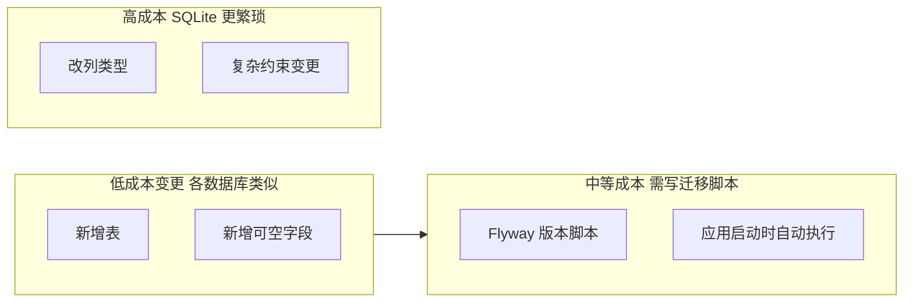

# workOrder 个人代办清单 — 技术选型

> **架构状态（2026-07-06）**：v1.0 MVP 曾采用 Java + Vaadin + JavaFX 方案并完成开发；因启动时 CPU/内存负担过大，**现迁移至 Tauri + Vue 3 + Rust**。下文 §2–§7 保留原方案供对照，§3、§8 为现行方案。详见 [Tauri 迁移设计](../docs/superpowers/specs/2026-07-06-tauri-migration-design.md)。

## 1. 选型原则

| 原则 | 说明 |
|------|------|
| 轻量 | 个人工具，无需独立部署数据库或 Web 服务器；**启动快、空闲资源占用低** |
| 可维护 | 架构清晰，业务规则集中，便于个人长期维护 |
| 桌面体验 | 双击 exe 启动，窗口常驻，拖拽交互流畅 |
| 数据便携 | SQLite 单文件，升级不丢数据 |
| 可扩展 | 后续可追加 REST API 或 Web 端（v3.0 观望） |

---

## 2. 原总体架构（v1.0 Java，已废弃）

```
┌─────────────────────────────────────────────┐
│              workOrder 桌面应用               │
│  ┌─────────────┐      ┌─────────────────┐  │
│  │ Vaadin Flow │ ───► │  Spring Boot 3   │  │
│  │  (UI 层)    │ 同进程 │  (Service 层)   │  │
│  └─────────────┘      └────────┬────────┘  │
│                                │            │
│                       ┌────────▼────────┐  │
│                       │ Spring Data JPA │  │
│                       └────────┬────────┘  │
│                                │            │
│                       ┌────────▼────────┐  │
│                       │     SQLite      │  │
│                       └─────────────────┘  │
└─────────────────────────────────────────────┘
         ▲
         │ jpackage 打包 + 启动器
         ▼
    Windows .exe（双击启动）
```

**关键设计**：

- Vaadin UI 与 Spring Boot **同一 JVM、同一进程**，View 直接注入 Service，MVP 无需额外 REST 层
- SQLite 单文件存储，数据文件位于用户目录（如 `%USERPROFILE%/.workOrder/`）
- 启动器负责：拉起 Spring Boot → 打开应用窗口

---

## 3. 现总体架构（Tauri，现行）

```
┌─────────────────────────────────────────┐
│              workOrder.exe              │
│  ┌─────────────┐    ┌────────────────┐  │
│  │  WebView2   │───►│   Vue 3 前端    │  │
│  └─────────────┘    └───────┬────────┘  │
│                             │ invoke    │
│                    ┌────────▼────────┐  │
│                    │ Tauri Commands  │  │
│                    └────────┬────────┘  │
│                    ┌────────▼────────┐  │
│                    │  Rust Services  │  │
│                    └────────┬────────┘  │
│                    ┌────────▼────────┐  │
│                    │    rusqlite     │  │
│                    └────────┬────────┘  │
└─────────────────────────────┼────────────┘
                              │
                    ┌─────────▼─────────┐
                    │  ./data/workorder.db │
                    └───────────────────┘
```

**关键设计**：

- **单进程**：无 JVM、无 localhost HTTP、无端口轮询
- 前端 Vue 3 通过 `invoke()` 调用 Rust Commands，Commands 转发至 Service 层
- **沿用现有 SQLite 表结构与数据文件**，迁移后可直接打开已有 `workorder.db`
- 打包使用 `npm run tauri build`，安装包约 10–20MB

### 3.1 为何从 Java 方案切换至 Tauri

| 现象 | 原因 | Tauri 如何解决 |
|------|------|----------------|
| 启动时 CPU 飙高、需等待数秒 | JVM 冷启动 + Spring Boot / Vaadin / Flyway 初始化 | 无 JVM，Rust 原生启动，通常 <1s 出窗口 |
| 内存 300–500MB+ | 嵌入式 JRE + Hibernate + 双 Web 引擎（JavaFX WebKit + Vaadin） | 单进程 + 系统 WebView2，约 50–80MB |
| 安装包 ~100MB+ | jpackage 捆绑完整 JRE 与 JavaFX 原生库 | Tauri 壳体积极小，无需 JRE |
| 空闲 CPU 偏高 | Vaadin 服务端轮询 / WebSocket 与 JavaFX 并存 | 纯本地 invoke，无 HTTP 侧车 |

原 Java 方案的优势（全 Java UI、View 直注 Service）在 MVP 验证后，被**桌面资源占用**问题抵消；业务逻辑体量小，移植至 Rust 成本可控，故采用**方案 1：原地替换**（删除 Java 栈，仓库改为 Tauri 单体）。

---

## 4. 原技术栈明细（v1.0 Java，已废弃）

| 层次 | 选型 | 版本建议 | 选型理由 |
|------|------|----------|----------|
| 语言 | Java | 17+ | LTS，Spring Boot 3 基线要求 |
| 应用框架 | Spring Boot | 3.2+ | 依赖注入、事务、配置管理 |
| UI 框架 | Vaadin Flow | 24+ | 纯 Java 写 UI，组件丰富，Spring 官方集成 |
| ORM | Spring Data JPA | — | 简化 CRUD，与 Spring Boot 一体 |
| 数据库 | SQLite | 3.x | 零配置、单文件、轻量 |
| SQLite 驱动 | org.xerial:sqlite-jdbc | 最新稳定版 | 成熟 JDBC 驱动 |
| Hibernate 方言 | sqlite-dialect 或 community 方案 | — | JPA 适配 SQLite |
| 数据库迁移 | Flyway | — | 版本化 SQL 脚本，应用启动时自动升级用户本地库 |
| 构建工具 | Maven | 3.9+ | 单模块或 parent + app 结构 |
| 打包 | jpackage | JDK 17+ 内置 | 生成 Windows 安装包 / exe |
| 启动器 | 自定义 Java Main | — | 启动 Spring Boot + 打开应用窗口 |

---

## 5. 现技术栈明细（Tauri，现行）

| 层次 | 选型 | 版本建议 | 选型理由 |
|------|------|----------|----------|
| 桌面壳 | Tauri | 2.x | 系统 WebView2，单进程，安装包小 |
| 前端框架 | Vue | 3.x | 组件化，适合中小型桌面 UI |
| UI 组件库 | Naive UI | 最新稳定版 | Vue 3 原生，现代桌面风格 |
| 拖拽 | vue-draggable-plus | — | 列表行拖拽排序 |
| 后端 | Rust | 2021 edition | Tauri 原生集成，性能好 |
| 数据库访问 | rusqlite | 0.32+（bundled） | 直接读写 SQLite，无 ORM 开销 |
| 序列化 | serde + chrono | — | 前后端数据传输与日期处理 |
| 构建（前端） | Vite | 5.x | 快速开发与热重载 |
| 打包 | `tauri build` | — | 生成 exe / MSI，替代 jpackage |

---

## 6. UI 方案对比与决策

### 4.1 候选方案回顾

| 方案 | UI 技术 | 打包体积 | 拖拽 | 全 Java | 结论 |
|------|---------|----------|------|---------|------|
| JavaFX | Java 原生 UI | ~50-80MB | 原生支持 | 是 | 未选：UI 代码量较大 |
| WebView 内嵌 | HTML + JS | ~60-90MB | 前端库 | 否 | 未选：需写前端 |
| Vaadin | Java 写 UI | ~70-100MB | Grid DragDrop | 是 | v1.0 曾选；后因资源占用废弃 |
| Swing + FlatLaf | JDK 内置 | ~40-60MB | 实现繁琐 | 是 | 未选：长期维护成本高 |
| Electron | Chromium | ~150MB+ | 好 | 否 | 未选：过重 |
| **Tauri** | **Rust + Web** | **~10-20MB** | **好** | **否** | **现行方案** |

### 6.1 原选择 Vaadin 的原因（v1.0，已废弃）

1. **全 Java 技术栈**：UI 与后端同一语言，View 直接 `@Autowired` Service
2. **组件开箱即用**：Grid、Dialog、DateTimePicker、ComboBox 覆盖 MVP 全部交互
3. **Spring Boot 官方 Starter**：`vaadin-spring-boot-starter` 一行依赖即可集成
4. **拖拽排序**：Vaadin Grid 支持行拖拽（DragDrop 扩展），满足优先级调整需求
5. **样式能力**：行样式生成器可实现 Deadline 过期高亮

### 6.2 现选择 Tauri + Vue 的原因

1. **启动与空闲资源占用低**：无 JVM，单进程 + 系统 WebView2
2. **安装包小**：约 10–20MB，无需捆绑 JRE
3. **业务体量可控**：Service 层逻辑可从 Java 直译至 Rust
4. **数据零迁移**：沿用现有 SQLite 文件与表结构
5. **桌面交互成熟**：Vue 生态有成熟的拖拽、表格、模态框组件

### 6.3 原 Vaadin 桌面化方案（v1.0，已废弃）

Vaadin 本质是服务端渲染 Web UI，桌面化通过以下方式实现：

| 方式 | 实现 | 优缺点 |
|------|------|--------|
| **推荐：JavaFX WebView 壳** | `WebViewShell` 内嵌 WebView 加载 localhost | 窗口完全自控；需注意 Vaadin 浮层组件在 Dialog/WebView 中失效，状态类控件用 RadioButtonGroup / Checkbox |
| 备选：Chrome App 模式 | 启动器执行 `chrome --app=http://localhost:{port}` | 无地址栏；依赖本机 Chrome/Edge；WebView 不可用时 fallback |

**MVP 桌面化**：优先 JavaFX WebView（`WebViewShell`），启动失败时 fallback 到 Chrome/Edge app 模式或系统默认浏览器。

**UI 约束**：WebView 内避免使用 `Select`、`MultiSelectComboBox` 等浮层组件（Dialog 内易不可点击）；状态选择与筛选改用 `RadioButtonGroup`、`Checkbox`。

### 6.4 现 Tauri 桌面化方案

- Tauri 窗口内嵌 **WebView2**，直接加载 Vue 构建产物（无 localhost HTTP）
- UI 使用 Naive UI 组件，浮层组件（Select、Dialog）在 WebView2 中无 JavaFX 时期的兼容问题
- 关闭窗口时由 Tauri 生命周期钩子清理资源

---

## 7. 数据存储方案

### 7.1 为何选 SQLite

| 对比项 | SQLite | H2 内嵌 | MySQL |
|--------|--------|---------|-------|
| 部署 | 单文件，零配置 | 内嵌或文件模式 | 需独立服务 |
| 持久化 | 文件级持久 | 文件模式可持久 | 需配置 |
| 体积 | 极小 | 小 | 大 |
| 个人工具适配 | 最佳 | 可用 | 过重 |

### 7.2 数据文件位置

```
{应用目录}/data/workorder.db
```

- 开发时默认为项目根目录 `data/workorder.db`
- 打包后默认为 exe 同目录 `data/`（与 jpackage 时期 `-Dworkorder.data.dir=./data` 一致）
- 可通过环境变量 `WORKORDER_DATA_DIR` 覆盖（后续版本）

### 7.3 数据模型

| 实体 | 表名 | 说明 |
|------|------|------|
| WorkOrder | work_order | 代办事项主表 |
| ProgressLog | progress_log | 处置过程记录 |

### 7.4 数据结构变更与迁移策略

#### SQLite 是否意味着改表代价大？

**不完全是。** SQLite 在 `ALTER TABLE` 能力上确实比 PostgreSQL / MySQL 弱，但对我们这种**个人桌面、数据量小、版本迭代以「加字段 / 加表」为主**的项目，实际代价可控。真正决定迁移成本的是**是否使用正规迁移工具**，而不是 SQLite 本身。

| 变更类型 | SQLite 支持度 | workOrder 各版本典型场景 |
|----------|---------------|--------------------------|
| 新增表 | 完全支持 | v1.2 的 Link、v2.0 的 SubTask |
| 新增可空列 | 完全支持（3.x） | v1.1 的 category、v2.0 的 projectName |
| 删除列 | 支持（3.35+） | 极少需要 |
| 修改列类型 / 重排约束 | 需「建新表 → 拷数据 → 换表名」 | 个人工具中几乎不会遇到 |
| 大量数据在线迁移 | 重建表较慢 | 不适用（通常仅数百～数千条） |

#### 与 MySQL 等相比的真实差异



- **MySQL / PostgreSQL**：复杂 `ALTER` 一条 SQL  often 够用
- **SQLite**：同类操作可能要 4 步（新表、INSERT SELECT、DROP、RENAME），但脚本仍是一次写好、自动执行
- **个人工具场景**：版本规划里的 v1.1～v2.0 变更几乎都属于「加表 / 加列」，SQLite 原生支持，**迁移成本与 MySQL 内嵌方案差距很小**

#### 真正会放大的风险（需主动规避）

| 风险 | 后果 | 应对 |
|------|------|------|
| 依赖 `ddl-auto=update` 自动改表 | 升级时不可控，用户本地库可能不一致 | **禁止**在生产/发布版使用；仅本地开发可选 |
| 无版本化迁移 | 用户从 v1.0 升到 v2.0 时结构对不上 | 版本化 SQL 脚本，启动时自动执行 |
| 破坏性变更（删列、改语义） | 旧数据丢失或报错 | 优先「加而不改」；必须改时写显式迁移 + 数据转换 |
| 不做启动前迁移 | 新版本打开旧库崩溃 | 应用启动流程：**执行 schema 迁移 → 再显示 UI** |

#### 选定方案：版本化 SQL（Rust 启动时执行）

| 时期 | 迁移机制 | 脚本位置 |
|------|----------|----------|
| v1.0 Java（已废弃） | Flyway | `src/main/resources/db/migration/` |
| Tauri（现行） | Rust 启动时执行 `CREATE IF NOT EXISTS` + 版本表 | `src-tauri/src/db/schema.sql` 及后续 `V2__*.sql` |

```
# 现行（Tauri）
src-tauri/src/db/
├── schema.sql                    # v1.0 初始表（源自 V1__init_schema.sql）
├── V2__add_category.sql          # v1.1 类型字段（规划）
└── ...

# 原 Java 方案（保留备查）
src/main/resources/db/migration/
└── V1__init_schema.sql
```

**应用升级流程**（桌面端每次启动）：

1. 解析数据目录，打开或创建 `workorder.db`
2. 对比迁移版本记录，执行未运行的脚本
3. 迁移成功后显示 Vue UI

####  schema 设计原则（降低未来变更成本）

1. **新能力优先新表**：如 Link、SubTask 独立建表，少改主表
2. **新字段默认可空**：旧数据无需回填即可升级
3. **枚举存 String**：Java 侧用 Enum，库中 `VARCHAR`，新增枚举值不必改表结构
4. **预留扩展字段（可选）**：若 v3 极不确定，可加 `metadata TEXT` 存 JSON；**MVP 不必做**，避免过度设计

#### 结论

| 问题 | 答案 |
|------|------|
| SQLite 会不会让以后改结构很难？ | **常规迭代不会**；复杂改列比 MySQL 麻烦，但本项目几乎用不到 |
| 比 MySQL 大在哪？ | 极端 schema 重构；**不是**我们版本规划里的加字段/加表 |
| 如何控制成本？ | **版本化 SQL 从 v1.0 开始** + 加表/加列优先 + 发布前测「旧库升级」 |

若未来数据量或复杂度远超个人工具范畴（如多用户、百万行、复杂报表），再评估迁移到 PostgreSQL 等；届时 SQL 迁移脚本大部分可复用，**不是从零重来**。

---

## 8. MVP 功能与 UI 组件映射

### 8.1 原 Vaadin 映射（v1.0，已废弃）

| 功能 | Vaadin 组件 / 方案 |
|------|-------------------|
| 任务列表 | `Grid<WorkOrder>` |
| 拖拽排序 | Grid Row Reorder / DragDrop 扩展 |
| 状态筛选 | 各状态 `Checkbox` 组合 |
| 隐藏已完成 | `Checkbox` + Grid 数据提供者过滤 |
| 新建/编辑 | `Dialog` + `TextField` / `TextArea` / `RadioButtonGroup` |
| 计划完成时间 | `DateTimePicker` |
| 待回复字段 | 条件渲染 `TextField`；保存时自动写入过程时间线 |
| 处置过程时间线 | `VerticalLayout` + 时间戳 `Span` + 编辑/删除按钮 |
| 过期高亮 | `grid.setClassNameGenerator()` |
| 主布局 | `AppLayout` |

### 8.2 现 Vue + Naive UI 映射（Tauri，现行）

| 功能 | Vue / Naive UI 方案 |
|------|---------------------|
| 任务列表 | `n-data-table` 或自定义列表 |
| 拖拽排序 | `vue-draggable-plus` |
| 状态筛选 | `n-checkbox-group` |
| 隐藏已完成 | `n-checkbox` |
| 新建/编辑 | `n-modal` + `n-form` + `n-input` / `n-radio-group` |
| 计划完成时间 | `n-date-picker`（含时间） |
| 待回复字段 | 条件渲染 `n-input`；保存时由 Rust Service 自动写入过程 |
| 处置过程时间线 | 列表 + `n-button` 编辑/删除 |
| 过期高亮 | CSS class `.overdue-row` |
| 主布局 | 单页 `App.vue` + `WorkOrderList.vue` |

---

## 9. 项目结构建议

### 9.1 原 Java 结构（v1.0，已废弃）

```
workOrder/
├── pom.xml
├── src/main/java/com/workorder/
│   ├── WorkOrderApplication.java
│   ├── launcher/          # DesktopLauncher, WebViewShell
│   ├── model/             # WorkOrder, ProgressLog, WorkOrderStatus
│   ├── repository/
│   ├── service/
│   └── view/              # MainLayout, WorkOrderListView, WorkOrderDetailDialog
└── src/main/resources/
    ├── application.properties
    └── db/migration/
```

### 9.2 现 Tauri 结构（现行）

```
workOrder/
├── src-tauri/
│   ├── src/
│   │   ├── commands/      # Tauri Commands（前端 invoke 入口）
│   │   ├── services/      # 业务逻辑（移植自 Java Service）
│   │   ├── db/            # schema.sql、连接管理
│   │   └── models/        # WorkOrder, ProgressLog, WorkOrderStatus
│   ├── Cargo.toml
│   └── tauri.conf.json
├── src/                   # Vue 3 前端
│   ├── views/             # WorkOrderList, WorkOrderDetail
│   ├── api/               # invoke 封装
│   └── composables/
├── package.json
├── vite.config.ts
├── data/workorder.db
└── plan/
```

---

## 10. 风险与应对

### 10.1 原 Java 方案风险（v1.0，已废弃）

| 风险 | 影响 | 应对 |
|------|------|------|
| JVM + Spring 启动慢 | 启动 CPU/内存高 | **已通过迁移 Tauri 解决** |
| SQLite + JPA 方言兼容性 | 部分 JPA 特性不支持 | 已废弃 |
| Vaadin 浮层 + WebView | Select/ComboBox 下拉失效 | 已废弃 |
| jpackage 打包体积 | ~80-100MB | 已废弃 |

### 10.2 现 Tauri 方案风险

| 风险 | 影响 | 应对 |
|------|------|------|
| Rust 学习曲线 | Service 层需用 Rust 编写 | 逻辑从 Java 直译；Commands 保持薄封装 |
| 工具链依赖 | 需 Node + Rust + VS Build Tools | 文档记录安装步骤；`rustup` 一次性配置 |
| WebView2 缺失 | 极少数 Win10 环境无运行时 | Tauri 安装包可捆绑 WebView2 bootstrapper |
| 日期格式兼容 | 新旧版本读写同一 DB | 统一 ISO 8601；迁移前用现有 DB 验证 |
| 迁移不可逆 | 替换后无法用 Java 版打开 | 迁移前 git tag 标记 Java 版本 |

---

## 11. 版本锁定建议

### 11.1 原 Java 方案（已废弃，备查）

```xml
<java.version>17</java.version>
<spring-boot.version>3.2.x</spring-boot.version>
<vaadin.version>24.5.x</vaadin.version>
```

### 11.2 现 Tauri 方案（写入 package.json / Cargo.toml）

```json
{ "vue": "^3.4", "@tauri-apps/api": "^2", "naive-ui": "^2" }
```

```toml
tauri = { version = "2", ... }
rusqlite = { version = "0.32", features = ["bundled"] }
```

具体版本在脚手架初始化时取各依赖最新稳定版。

---

## 12. 变更记录

| 日期 | 变更 |
|------|------|
| 2026-07-06 | 初版：Vaadin + Spring Boot + JavaFX 选型 |
| 2026-07-06 | **架构迁移**：保留原 Java 方案备查；现行方案改为 Tauri 2 + Vue 3 + Rust + rusqlite。原因：启动 CPU/内存负担过大，Tauri 单进程方案可显著降低资源占用，业务逻辑体量可控可移植。 |
