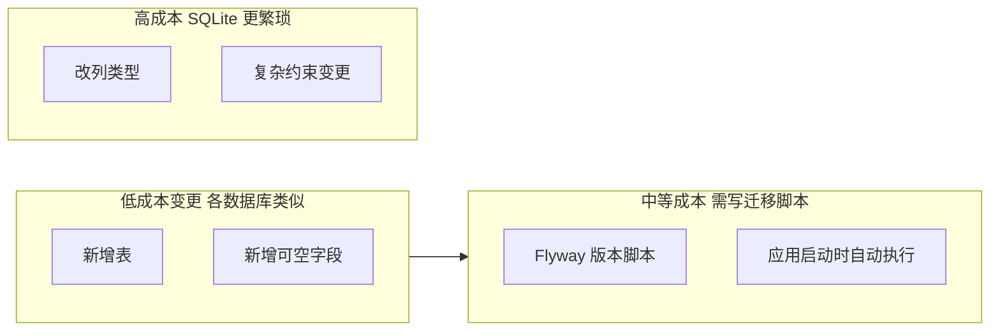

# workOrder 个人代办清单 — 技术选型

## 1. 选型原则

| 原则 | 说明 |
|------|------|
| 轻量 | 个人工具，无需独立部署数据库或 Web 服务器 |
| Java 后端契合 | 技术栈以 Java 为主，便于后端开发者维护 |
| 全 Java UI | 不写 HTML/JS/CSS，UI 层使用 Java 框架 |
| 可扩展 | 架构清晰，后续可追加 REST API 或 Web 端 |
| 桌面体验 | 双击 exe 启动，窗口常驻，拖拽交互流畅 |

---

## 2. 总体架构

```
┌─────────────────────────────────────────────┐
│              workOrder 桌面应用               │
│  ┌─────────────┐      ┌─────────────────┐  │
│  │ Vaadin Flow │ ───► │  Spring Boot 3   │  │
│  │  (UI 层)    │ 同进程 │  (Service 层)   │  │
│  └─────────────┘      └────────┬────────┘  │
│                                │            │
│                       ┌────────▼────────┐  │
│                       │ Spring Data JPA │  │
│                       └────────┬────────┘  │
│                                │            │
│                       ┌────────▼────────┐  │
│                       │     SQLite      │  │
│                       └─────────────────┘  │
└─────────────────────────────────────────────┘
         ▲
         │ jpackage 打包 + 启动器
         ▼
    Windows .exe（双击启动）
```

**关键设计**：

- Vaadin UI 与 Spring Boot **同一 JVM、同一进程**，View 直接注入 Service，MVP 无需额外 REST 层
- SQLite 单文件存储，数据文件位于用户目录（如 `%USERPROFILE%/.workOrder/`）
- 启动器负责：拉起 Spring Boot → 打开应用窗口

---

## 3. 技术栈明细

| 层次 | 选型 | 版本建议 | 选型理由 |
|------|------|----------|----------|
| 语言 | Java | 17+ | LTS，Spring Boot 3 基线要求 |
| 应用框架 | Spring Boot | 3.2+ | 依赖注入、事务、配置管理 |
| UI 框架 | Vaadin Flow | 24+ | 纯 Java 写 UI，组件丰富，Spring 官方集成 |
| ORM | Spring Data JPA | — | 简化 CRUD，与 Spring Boot 一体 |
| 数据库 | SQLite | 3.x | 零配置、单文件、轻量 |
| SQLite 驱动 | org.xerial:sqlite-jdbc | 最新稳定版 | 成熟 JDBC 驱动 |
| Hibernate 方言 | sqlite-dialect 或 community 方案 | — | JPA 适配 SQLite |
| 数据库迁移 | Flyway | — | 版本化 SQL 脚本，应用启动时自动升级用户本地库 |
| 构建工具 | Maven | 3.9+ | 单模块或 parent + app 结构 |
| 打包 | jpackage | JDK 17+ 内置 | 生成 Windows 安装包 / exe |
| 启动器 | 自定义 Java Main | — | 启动 Spring Boot + 打开应用窗口 |

---

## 4. UI 方案对比与决策

### 4.1 候选方案回顾

| 方案 | UI 技术 | 打包体积 | 拖拽 | 全 Java | 结论 |
|------|---------|----------|------|---------|------|
| JavaFX | Java 原生 UI | ~50-80MB | 原生支持 | 是 | 未选：UI 代码量较大 |
| WebView 内嵌 | HTML + JS | ~60-90MB | 前端库 | 否 | 未选：需写前端 |
| **Vaadin** | **Java 写 UI** | **~70-100MB** | **Grid DragDrop** | **是** | **已选** |
| Swing + FlatLaf | JDK 内置 | ~40-60MB | 实现繁琐 | 是 | 未选：长期维护成本高 |
| Electron | Chromium | ~150MB+ | 好 | 否 | 未选：过重 |
| Tauri | Rust + Web | ~10-20MB | 好 | 否 | 未选：架构复杂 |

### 4.2 选择 Vaadin 的原因

1. **全 Java 技术栈**：UI 与后端同一语言，View 直接 `@Autowired` Service
2. **组件开箱即用**：Grid、Dialog、DateTimePicker、ComboBox 覆盖 MVP 全部交互
3. **Spring Boot 官方 Starter**：`vaadin-spring-boot-starter` 一行依赖即可集成
4. **拖拽排序**：Vaadin Grid 支持行拖拽（DragDrop 扩展），满足优先级调整需求
5. **样式能力**：行样式生成器可实现 Deadline 过期高亮

### 4.3 Vaadin 桌面化方案

Vaadin 本质是服务端渲染 Web UI，桌面化通过以下方式实现：

| 方式 | 实现 | 优缺点 |
|------|------|--------|
| **推荐：Chrome App 模式** | 启动器执行 `chrome --app=http://localhost:{port}` | 无地址栏，体验接近原生；依赖本机 Chrome/Edge |
| 备选：JavaFX WebView 壳 | 小窗口内嵌 WebView 加载 localhost | 完全自控窗口；需额外 JavaFX 依赖 |

**MVP 推荐 Chrome App 模式**：实现简单，窗口体验好。打包时启动器检测默认浏览器并以 app 模式打开。

---

## 5. 数据存储方案

### 5.1 为何选 SQLite

| 对比项 | SQLite | H2 内嵌 | MySQL |
|--------|--------|---------|-------|
| 部署 | 单文件，零配置 | 内嵌或文件模式 | 需独立服务 |
| 持久化 | 文件级持久 | 文件模式可持久 | 需配置 |
| 体积 | 极小 | 小 | 大 |
| 个人工具适配 | 最佳 | 可用 | 过重 |

### 5.2 数据文件位置

```
%USERPROFILE%/.workOrder/data/workorder.db
```

- 应用首次启动时自动创建目录和数据库
- 可通过配置文件指定路径（后续版本）

### 5.3 JPA 实体

| 实体 | 表名 | 说明 |
|------|------|------|
| WorkOrder | work_order | 代办事项主表 |
| ProgressLog | progress_log | 处置过程记录 |

### 5.4 数据结构变更与迁移策略

#### SQLite 是否意味着改表代价大？

**不完全是。** SQLite 在 `ALTER TABLE` 能力上确实比 PostgreSQL / MySQL 弱，但对我们这种**个人桌面、数据量小、版本迭代以「加字段 / 加表」为主**的项目，实际代价可控。真正决定迁移成本的是**是否使用正规迁移工具**，而不是 SQLite 本身。

| 变更类型 | SQLite 支持度 | workOrder 各版本典型场景 |
|----------|---------------|--------------------------|
| 新增表 | 完全支持 | v1.2 的 Link、v2.0 的 SubTask |
| 新增可空列 | 完全支持（3.x） | v1.1 的 category、v2.0 的 projectName |
| 删除列 | 支持（3.35+） | 极少需要 |
| 修改列类型 / 重排约束 | 需「建新表 → 拷数据 → 换表名」 | 个人工具中几乎不会遇到 |
| 大量数据在线迁移 | 重建表较慢 | 不适用（通常仅数百～数千条） |

#### 与 MySQL 等相比的真实差异



- **MySQL / PostgreSQL**：复杂 `ALTER` 一条 SQL  often 够用
- **SQLite**：同类操作可能要 4 步（新表、INSERT SELECT、DROP、RENAME），但脚本仍是一次写好、自动执行
- **个人工具场景**：版本规划里的 v1.1～v2.0 变更几乎都属于「加表 / 加列」，SQLite 原生支持，**迁移成本与 MySQL 内嵌方案差距很小**

#### 真正会放大的风险（需主动规避）

| 风险 | 后果 | 应对 |
|------|------|------|
| 依赖 `ddl-auto=update` 自动改表 | 升级时不可控，用户本地库可能不一致 | **禁止**在生产/发布版使用；仅本地开发可选 |
| 无版本化迁移 | 用户从 v1.0 升到 v2.0 时结构对不上 | 从 **v1.0 起引入 Flyway** |
| 破坏性变更（删列、改语义） | 旧数据丢失或报错 | 优先「加而不改」；必须改时写显式迁移 + 数据转换 |
| 不做启动前迁移 | 新版本打开旧库崩溃 | 应用启动流程：**Flyway migrate → 再启动 UI** |

#### 选定方案：Flyway + 版本化 SQL

从 v1.0 脚手架阶段即引入 **Flyway**，每次发版附带迁移脚本：

```
src/main/resources/db/migration/
├── V1__init_schema.sql          # v1.0 初始表
├── V2__add_category.sql           # v1.1 类型字段
├── V3__add_link_table.sql         # v1.2 链接表
└── V4__add_subtask_and_project.sql # v2.0 子任务与项目
```

**应用升级流程**（桌面端每次启动）：

1. 检测 `%USERPROFILE%/.workOrder/data/workorder.db`
2. Flyway 对比 `flyway_schema_history`，执行未运行的脚本
3. 迁移成功后启动 Vaadin UI

####  schema 设计原则（降低未来变更成本）

1. **新能力优先新表**：如 Link、SubTask 独立建表，少改主表
2. **新字段默认可空**：旧数据无需回填即可升级
3. **枚举存 String**：Java 侧用 Enum，库中 `VARCHAR`，新增枚举值不必改表结构
4. **预留扩展字段（可选）**：若 v3 极不确定，可加 `metadata TEXT` 存 JSON；**MVP 不必做**，避免过度设计

#### 结论

| 问题 | 答案 |
|------|------|
| SQLite 会不会让以后改结构很难？ | **常规迭代不会**；复杂改列比 MySQL 麻烦，但本项目几乎用不到 |
| 比 MySQL 大在哪？ | 极端 schema 重构；**不是**我们版本规划里的加字段/加表 |
| 如何控制成本？ | **Flyway 从 v1.0 开始** + 加表/加列优先 + 发布前测「旧库升级」 |

若未来数据量或复杂度远超个人工具范畴（如多用户、百万行、复杂报表），再评估迁移到 PostgreSQL 等；届时 Flyway 脚本大部分可复用，**不是从零重来**。

---

## 6. MVP 功能与 Vaadin 组件映射

| 功能 | Vaadin 组件 / 方案 |
|------|-------------------|
| 任务列表 | `Grid<WorkOrder>` |
| 拖拽排序 | Grid Row Reorder / DragDrop 扩展 |
| 状态筛选 | `MultiSelectComboBox<WorkOrderStatus>` |
| 隐藏已完成 | `Checkbox` + Grid 数据提供者过滤 |
| 新建/编辑 | `Dialog` + `TextField` / `TextArea` / `Select` |
| 计划完成时间 | `DateTimePicker` |
| 待回复字段 | 条件渲染 `TextField`（状态=待回复时显示） |
| 处置过程时间线 | `VerticalLayout` + 时间戳 `Span` |
| 过期高亮 | `grid.setClassNameGenerator()` 返回 CSS 类名 |
| 主布局 | `AppLayout`（导航栏 + 内容区） |

---

## 7. 项目结构建议

```
workOrder/
├── pom.xml
├── src/main/java/com/workorder/
│   ├── WorkOrderApplication.java       # Spring Boot 入口
│   ├── launcher/
│   │   └── DesktopLauncher.java        # 桌面启动器（jpackage 入口）
│   ├── model/
│   │   ├── WorkOrder.java              # 实体
│   │   ├── WorkOrderStatus.java        # 状态枚举
│   │   └── ProgressLog.java            # 实体
│   ├── repository/
│   │   ├── WorkOrderRepository.java
│   │   └── ProgressLogRepository.java
│   ├── service/
│   │   ├── WorkOrderService.java
│   │   └── ProgressLogService.java
│   └── view/
│       ├── MainLayout.java             # 主布局
│       ├── WorkOrderListView.java      # 列表页（含筛选、拖拽）
│       └── WorkOrderDetailDialog.java  # 详情/编辑对话框
├── src/main/resources/
│   ├── application.properties          # SQLite 配置
│   └── META-INF/resources/themes/      # Vaadin 主题（过期高亮样式）
└── plan/                               # 本文档所在目录
```

---

## 8. 风险与应对

| 风险 | 影响 | 应对 |
|------|------|------|
| SQLite + JPA 方言兼容性 | 部分 JPA 特性不支持 | 使用社区 sqlite-dialect；避免复杂 JPQL |
| Vaadin Grid 拖拽体验 | 可能不如原生 ListView 流畅 | MVP 先实现基本拖拽；必要时换自定义 List 组件 |
| Chrome App 模式依赖浏览器 | 无 Chrome/Edge 时无法打开窗口 | 启动器 fallback 到默认浏览器；或改用 WebView 壳 |
| jpackage 打包体积 | ~80-100MB | 个人工具可接受；后续可用 jlink 瘦身 |
| Vaadin 学习曲线 | 首次使用需熟悉组件模型 | 官方文档 + Start 模板快速上手 |

---

## 9. 版本锁定建议（实现时写入 pom.xml）

```xml
<java.version>17</java.version>
<spring-boot.version>3.2.x</spring-boot.version>
<vaadin.version>24.5.x</vaadin.version>
```

具体版本在创建项目时取各依赖最新稳定版。
