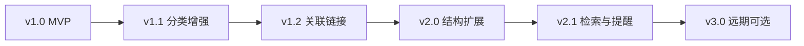
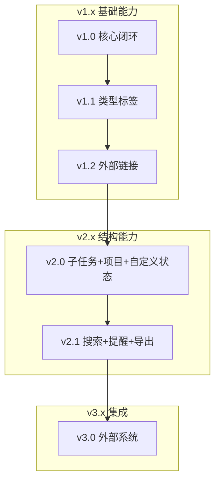

# workOrder 个人代办清单 — 版本规划

## 1. 文档说明

本文档定义 workOrder 各版本的功能范围、更新目标与发布节奏，与 [需求文档](./需求文档.md)、[实现计划](./实现计划.md)、[技术选型](./技术选型.md) 配套使用。

**版本命名规则**：`v主版本.次版本` — 主版本表示架构或体验级变更，次版本表示功能增量。

**优先级定义**：

| 标记 | 含义 |
|------|------|
| P0 | 当前版本必须完成 |
| P1 | 下一版本优先 |
| P2 | 有明确价值，按节奏排期 |
| P3 | 观望项，有真实痛点再做 |

---

## 2. 版本总览



| 版本 | 主题 | 目标 | 状态 |
|------|------|------|------|
| **v1.0** | MVP 核心闭环 | 能记、能追、能看、能排序 | 待开发 |
| **v1.1** | 分类增强 | 按事项性质区分与筛选 | 规划中 |
| **v1.2** | 外部关联 | 减少上下文切换 | 规划中 |
| **v2.0** | 结构扩展 | 复杂任务拆解与多项目并行 | 规划中 |
| **v2.1** | 检索与提醒 | 清单变大后的效率工具 | 远期 |
| **v3.0** | 集成与协作 | 仅在确有需求时启动 | 观望 |

---

## 3. v1.0 — MVP（当前目标）

**主题**：个人代办核心闭环  
**交付形态**：Vaadin + Spring Boot + SQLite 轻量桌面端（Windows exe）  
**预计工期**：约 4–5 天（参见实现计划 P1–P4）

### 3.1 功能清单

| 编号 | 功能 | 优先级 | 来源 |
|------|------|--------|------|
| V10-01 | 创建 / 编辑 / 删除代办 | P0 | 脑图 |
| V10-02 | 标题（必填）+ 描述（可选） | P0 | 补充 #1 |
| V10-03 | 创建时间 / 最后更新时间 | P0 | 补充 #1 |
| V10-04 | 四种内置状态（单选） | P0 | 脑图 + 补充 #4 |
| V10-05 | 待回复：等待对象 + 等待原因 | P0 | 补充 #2 |
| V10-06 | 处置过程时间线（追加记录） | P0 | 脑图 |
| V10-07 | 拖拽调整优先级 | P0 | 脑图 |
| V10-08 | 按状态筛选（多状态组合） | P0 | 补充 #3 |
| V10-09 | 隐藏 / 显示已完成 | P0 | 补充 #3 |
| V10-10 | 计划完成时间（可选） | P0 | 补充 #8 |
| V10-11 | 过期未完成视觉高亮 | P0 | 补充 #8 |
| V10-12 | Windows 桌面打包（双击启动） | P0 | 交付形态 |

### 3.2 本版本不做

- 任务类型标签、外部链接、子任务、项目/服务模块
- 自定义状态多选
- 全文搜索、系统通知、多用户协作

### 3.3 发布标准

- [需求文档](./需求文档.md) 第 6 节验收标准全部通过
- Service 层单元测试通过
- exe 在 Windows 10+ 可正常启动与持久化数据

---

## 4. v1.1 — 分类增强

**主题**：区分「这是什么性质的事」  
**触发条件**：v1.0 日常使用 1–2 周，感觉仅靠状态无法区分 Bug / 需求 / 线上问题  
**预计工期**：约 1–2 天

### 4.1 功能清单

| 编号 | 功能 | 优先级 | 说明 |
|------|------|--------|------|
| V11-01 | 任务类型标签 | P1 | 与状态标签独立，回答「事项性质」 |
| V11-02 | 内置类型预设 | P1 | Bug 修复、新需求、Code Review、线上故障、技术债务、会议/沟通 |
| V11-03 | 按类型筛选 | P1 | 与状态筛选组合（如「线上故障 + 未处置」） |
| V11-04 | 列表展示类型 | P1 | Grid 增加类型列或图标 |
| V11-05 | 自定义类型（可选） | P2 | 用户新增类型名称；MVP 可先只做内置 |

### 4.2 数据变更

```text
WorkOrder 新增字段：
  - category: Enum 或 String（类型标签）
```

### 4.3 验收标准

- [ ] 创建/编辑时可选择类型
- [ ] 列表可按类型筛选，可与状态筛选叠加
- [ ] 已有数据默认类型为「未分类」或「其他」

---

## 5. v1.2 — 外部关联

**主题**：一键跳转到相关外部资源  
**触发条件**：频繁在 workOrder 与 Git / 工单 / 文档之间来回切换  
**预计工期**：约 1–2 天

### 5.1 功能清单

| 编号 | 功能 | 优先级 | 说明 |
|------|------|--------|------|
| V12-01 | 关联链接（多条） | P1 | 每条链接含 URL + 标签 |
| V12-02 | 内置链接标签预设 | P1 | PR、工单、接口文档、日志/监控 |
| V12-03 | 详情页展示链接列表 | P1 | 点击可在系统浏览器打开 |
| V12-04 | 新增 / 删除链接 | P1 | 在任务详情 Dialog 内管理 |
| V12-05 | 链接有效性提示（可选） | P3 | 格式校验即可，不做在线检测 |

### 5.2 数据变更

```text
新增实体 Link：
  - id, workOrderId, label, url, createdAt
```

### 5.3 验收标准

- [ ] 一个任务可绑定多条链接
- [ ] 点击链接在默认浏览器打开
- [ ] 删除任务时级联删除关联链接

---

## 6. v2.0 — 结构扩展

**主题**：支撑更复杂的后端工作事项  
**触发条件**：单条任务描述过长，或并行多个项目/服务  
**预计工期**：约 3–5 天

### 6.1 功能清单

| 编号 | 功能 | 优先级 | 说明 |
|------|------|--------|------|
| V20-01 | 子任务 / 检查清单 | P1 | 结构化步骤，可勾选完成 |
| V20-02 | 子任务进度展示 | P1 | 如「3/5 已完成」 |
| V20-03 | 所属项目 / 服务模块 | P1 | 如 order-service、payment-api |
| V20-04 | 环境标识（可选） | P2 | dev / staging / prod |
| V20-05 | 按项目筛选 | P1 | 与状态、类型筛选组合 |
| V20-06 | 自定义状态标签 | P2 | 用户自建状态名 |
| V20-07 | 状态多选组合 | P2 | 一条任务可同时标「线上故障 + 待回复」 |

### 6.2 与 v1.0「过程时间线」的关系

| 能力 | 用途 |
|------|------|
| 处置过程（v1.0 已有） | 自由文本时间线，记录排查过程 |
| 子任务（v2.0 新增） | 结构化、可勾选的步骤清单 |

两者并存，不互相替代。

### 6.3 数据变更

```text
新增实体 SubTask：
  - id, workOrderId, title, completed, sortOrder

WorkOrder 新增字段：
  - projectName: String
  - environment: Enum（可选）
  
新增实体 CustomStatusLabel（若做 V20-06/07）：
  - id, name, color
WorkOrder 与 CustomStatusLabel 多对多
```

### 6.4 验收标准

- [ ] 任务下可增删子任务并勾选完成
- [ ] 可按项目名筛选
- [ ] 自定义状态可创建并应用到任务（若纳入本版本）

---

## 7. v2.1 — 检索与提醒

**主题**：清单规模变大后的效率提升  
**触发条件**：任务量超过 100 条，查找和 deadline 管理变困难  
**预计工期**：约 2–3 天  
**备注**：原 Nice-to-have 中的部分能力在此版本重新评估

### 7.1 功能清单

| 编号 | 功能 | 优先级 | 说明 |
|------|------|--------|------|
| V21-01 | 标题 / 描述全文搜索 | P2 | 简单 LIKE 或 SQLite FTS |
| V21-02 | 组合筛选面板 | P2 | 状态 + 类型 + 项目 + 关键词一次过滤 |
| V21-03 | 今日到期 / 本周到期视图 | P2 | 快捷筛选 dueDate |
| V21-04 | 系统托盘 + 最小化 | P2 | 常驻后台，快速唤起 |
| V21-05 | Deadline 桌面通知（可选） | P3 | 到期前 N 小时提醒；需评估是否真的需要 |
| V21-06 | 数据导出（JSON/CSV） | P2 | 备份与迁移 |

### 7.2 验收标准

- [ ] 搜索响应在个人数据规模下 < 500ms
- [ ] 导出文件可导入（为 v3 迁移打基础）

---

## 8. v3.0 — 集成与协作（观望）

**主题**：仅在确有需求时启动  
**当前决策**：暂不考虑，列入远期观望

### 8.1 候选功能

| 编号 | 功能 | 优先级 | 启动条件 |
|------|------|--------|----------|
| V30-01 | REST API 对外开放 | P3 | 需要手机端或其他客户端 |
| V30-02 | Git 分支 / PR 自动关联 | P3 | 手动贴链接痛点足够大 |
| V30-03 | Jira / 禅道 Webhook 同步 | P3 | 团队强制用工单系统 |
| V30-04 | 多设备同步 | P3 | 需要在多台电脑使用 |
| V30-05 | 任务依赖（A 阻塞 B） | P3 | 个人清单编排复杂度上升 |
| V30-06 | 重复任务模板 | P3 | 周会/日报等规律事务增多 |
| V30-07 | 工时 / 估点统计 | P3 | 需要向上汇报 |

### 8.2 原则

- 每项功能需满足：**个人使用中至少连续 2 周感到明显痛点**
- 不做「为了功能完整而做」的集成
- 优先保持工具轻量

---

## 9. 版本依赖关系



| 依赖 | 说明 |
|------|------|
| v1.1 依赖 v1.0 | 在稳定核心上增加类型维度 |
| v1.2 依赖 v1.0 | 链接挂载在 WorkOrder 上，与类型无关 |
| v1.1 与 v1.2 可互换顺序 | 取决于哪个痛点先出现 |
| v2.0 依赖 v1.x | 需要稳定的任务模型再扩展结构 |
| v2.1 依赖 v2.0 或 v1.x 数据量 | 搜索在项目/子任务字段存在时更有价值 |
| v3.0 依赖 v2.1 导出能力 | 集成前先有数据迁移/备份方案 |

---

## 10. 建议发布节奏

| 阶段 | 版本 | 建议时机 | 说明 |
|------|------|----------|------|
| 第 1 周 | v1.0 | 立即启动 | 先自用起来 |
| 第 2–3 周 | v1.1 或 v1.2 | 按痛点选择 | 不必两个都做才继续 |
| 第 4–6 周 | 另一个 v1.x | 补齐分类或链接 | 保持小步迭代 |
| 第 2 月 | v2.0 | 清单复杂度上升时 | 子任务和项目模块 |
| 第 3 月+ | v2.1 | 任务量 > 100 时 | 搜索与提醒 |
| 按需 | v3.0 | 有明确集成需求时 | 不预设时间表 |

**原则**：每个版本发布后 **实际使用 1–2 周**，根据真实痛点决定下一版做什么，而非按文档机械推进。

---

## 11. 版本与需求文档对照

| 原需求编号 | 需求内容 | 目标版本 |
|------------|----------|----------|
| 脑图核心 | 列举 / 追踪 / 状态 / 拖拽 | v1.0 |
| 补充 #1 | 标题、描述、时间 | v1.0 |
| 补充 #2 | 待回复上下文 | v1.0 |
| 补充 #3 | 筛选与视图 | v1.0 |
| 补充 #4 | 状态语义 | v1.0 |
| 补充 #8 | Deadline + 过期高亮 | v1.0 |
| 补充 #6 | 任务类型标签 | v1.1 |
| 补充 #5 | 外部关联链接 | v1.2 |
| 补充 #7 | 子任务清单 | v2.0 |
| 补充 #9 | 项目 / 服务模块 | v2.0 |
| 脑图扩展 | 自定义状态多选 | v2.0 |
| Nice-to-have | 搜索、提醒、依赖、协作等 | v2.1 / v3.0 |

---

## 12. 变更记录

| 日期 | 版本 | 变更说明 |
|------|------|----------|
| 2026-07-06 | — | 初版：基于需求讨论确认结果编写 |

---

## 13. 下一步

1. 按 [实现计划](./实现计划.md) 完成 **v1.0** 开发与验收
2. v1.0 投入使用 1–2 周后，根据痛点从 v1.1 / v1.2 中选择下一版
3. 本文档随版本发布持续更新「状态」列与变更记录
